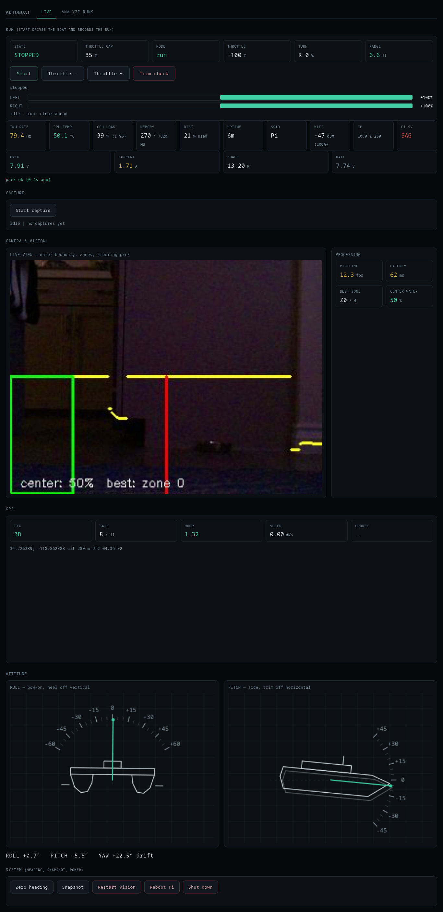

# AutoBoat

An autonomous RC catamaran that patrols a backyard pool, avoiding the walls on
its own. A Raspberry Pi 4B runs the perception, control, and a live web dashboard;
obstacle avoidance is reactive, driven by a forward time-of-flight rangefinder with
a camera-based vision pipeline as a steering aid.



## What it does

The boat drives forward under its own control and turns away from obstacles before
hitting them. The core loop, running on the Pi about 15-30 times a second:

1. **See** — a downward camera segments water from not-water and a forward ToF
   sensor measures the distance to whatever is ahead.
2. **Decide** — a small state machine (`assess -> run -> pivot -> backup`) chooses
   whether to drive, turn in place, or reverse.
3. **Act** — two motors via a DRV8833 H-bridge, with trim, kickstart, watchdog,
   and per-mode duty caps.
4. **Record** — every frame's telemetry, the camera image, and a session manifest
   are logged for later analysis.

All of this is visible and controllable from a web dashboard on the same network.

## Why the ToF, not just the camera

The pool's plaster walls are colour- and texture-matched to the water, and at the
camera's near-water viewing angle a wall looks identical to open water. This was
verified exhaustively — a trained patch classifier, edge and mirror-symmetry
detectors, and a pretrained monocular-depth network all failed to see the wall at
approach distance, because the distance information simply is not in the pixels at
this geometry. The camera is therefore used only for **steering** (which way is
more open); the **ToF** is the obstacle authority, because it measures distance
directly regardless of how well the wall is camouflaged.

Measured reality: outdoors the ToF's usable range is about 1.2 m (sunlight washes
out the infrared), not the 4 m on the spec sheet. The control thresholds are set
for that.

## Architecture

The code is split so that the control logic is hardware-free and unit-testable,
the dashboard is just an HTTP server, and every device lives in its own module.

```
autoboat/
  autoboat_dashboard.py   HTTP server: routes, page serving, thread startup
  pilot.py                camera loop (vision -> controller -> motors), Start/Stop
  recording.py            session capture, telemetry schema, Analyze-tab readers
  pipeline.py             vision: water segmentation, depth-per-column, zones
  control/
    controller.py         the avoidance brain — pure Python, no hardware imports
  hardware/
    bus.py                shared I2C bus handle
    imu.py                MPU-6050 attitude (roll/pitch/yaw, gyro)
    motors.py             DRV8833 actuation, trim, watchdog, ARMED flag
    power.py              INA219 pack monitor, critical-battery shutdown
    gps.py                VK-162 NMEA reader
    tof.py                single VL53L1X forward rangefinder
    tof_array.py          five-VL53L1X array (front / +-45 / +-90)
    sysmon.py             CPU / memory / wifi / throttle metrics
  static/
    index.html            the dashboard web UI
  test_autoboat_control.py  controller unit tests (run anywhere, no hardware)
  docs/
    dashboard.png         dashboard screenshot
```

Every hardware module is **optional**: if a device or its library is missing, that
module reports offline and the rest of the system runs normally. The same property
makes the controller importable on any machine for testing.

### The controller

`control/controller.py` is the decision-making core, deliberately free of any
hardware or framework imports so it can be tested and replayed against logged
sessions. Its modes:

- **assess** — read what's ahead before moving (entered on Start).
- **run** — drive forward; the camera centroid steers, the ToF gates the path.
- **pivot** — a committed in-place tank turn. When the ToF blocks, the boat turns
  until the gyro confirms it has swept at least 90 degrees, then resumes. At a
  corner it keeps turning the *same* direction rather than oscillating.
- **backup** — reverse to gain room, used only when physically pinned (gyro says
  it isn't rotating, or current says it's grinding), not on the camera's opinion.

Stall detection is **relative**: it triggers on a current *rise* above a slow
baseline (a wall grind pulls 2-3x cruise), so it stays correct even if the absolute
current reading drifts. With the five-sensor array present, turns become
**sighted** — the boat turns toward the beam that actually reads open instead of
guessing from vision.

Key thresholds (see `control/controller.py` for the full annotated list):

| Behaviour            | Value     |
|----------------------|-----------|
| ToF block distance   | 0.50 m    |
| ToF clear (hysteresis)| 0.70 m   |
| ToF slow zone        | 0.90 m    |
| Committed turn       | >= 90 deg |
| Stall trigger (rise) | 700 mA over baseline |

## The dashboard

Open `http://<pi-ip>:8000` from any device on the same network.

- **Live tab** — Start/Stop the autonomous run, live state (mode, throttle, turn,
  range), motor command bars, camera view with the vision overlay, and system
  cards (IMU rate, CPU, memory, battery, Pi 5V rail).
- **Analyze tab** — browse recorded sessions, scrub frames, re-run the vision
  pipeline on saved frames, and chart telemetry.

The page is served from `static/index.html`, so UI edits only need a browser
refresh — no service restart.

## Hardware

| Part            | Interface          | Notes |
|-----------------|--------------------|-------|
| Raspberry Pi 4B | —                  | brain, runs everything |
| OV5647 camera   | CSI                | downward water segmentation |
| MPU-6050        | I2C bus 1 (0x68)   | heading for committed turns |
| INA219          | I2C bus 3 (0x40)   | pack voltage / current |
| VL53L1X ToF     | I2C bus 5 (0x29)   | forward range — the obstacle authority |
| 5x VL53L1X array| I2C bus 5 (0x2a-2e)| front / +-45 / +-90, sighted turns (optional upgrade) |
| DRV8833         | GPIO 17/27/22/23/24| dual motor driver |
| VK-162 GPS      | USB                | logged only; too coarse to navigate a pool |
| 2S LiPo         | —                  | power |

Wiring diagrams are generated by `make_wiring.py` (base system) and
`make_array_wiring.py` (the five-sensor ToF array).

## Running it

The dashboard runs as a systemd service (`autoboat-dashboard`) started at boot:

```
sudo systemctl restart autoboat-dashboard      # after deploying code
journalctl -u autoboat-dashboard -f            # watch the logs
```

To run the controller tests (no hardware required):

```
python3 test_autoboat_control.py
```

## Development notes

- **Deploying:** the running Python holds the old code until the service restarts —
  always restart after copying. The session manifest records the live controller
  parameters, so checking a fresh manifest confirms the new code is actually
  running.
- **UI changes** only need a browser refresh (the page is served from disk).
- **Replaying sessions:** the controller is pure Python, so logged telemetry can be
  fed back through it to test changes. This is exact only for changes that don't
  alter the trajectory; behaviour changes still need a real water run to confirm.

## Status

Reactive wall avoidance works well: in the latest runs the boat spends about
two-thirds of its time driving forward, turns decisively when it meets a wall, and
rarely if ever needs to reverse. The current focus is the five-sensor ToF array,
which makes turns sighted (turn toward the open side) and gives awareness of walls
to the sides during a maneuver — the main remaining limitation of the single
forward beam.
